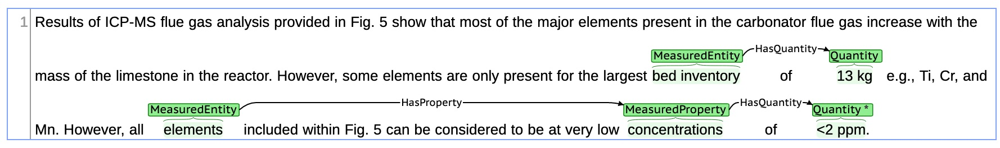

### Welcome to MeasEval: Counts and Measurements!

Counts and measurements are an important part of scientific discourse. It is relatively easy to find measurements in text, but a bare measurement like 17 mg is not informative. However, relatively little attention has been given to parsing and extracting these important semantic relations. This is challenging because the way scientists write can be ambiguous and inconsistent, and the location of this information relative to the measurement can vary greatly.

MeasEval is a new entity and semantic relation extraction task focused on finding counts and measurements, attributes of these quantities, and additional information including measured entities, properties, and measurement contexts.

For more details and to participate, head over to our CodaLab pages:
[https://competitions.codalab.org/competitions/25770](https://competitions.codalab.org/competitions/25770)

### Data Formats and Availability

All data will be made available through this following Github repository.

Data releases will include a text file for each paragraph of scientific text as well as annotations to be provided in two formats. Annotations are provided in a tab separated value (.tsv) file format, and also in the BRAT annotation format. The BRAT format is for the purpose of visualization and review, but the official data format is the .tsv, which will be used for submissions and evaluation. For .tsv and .txt files, one file per paragraph of annotated text will be provided. For the BRAT files, there will be an additional set of 1 .ann and 1 .txt file per annotated Quantity. These will be found in the brat directory.

For example, given the BRAT annotations illustrated in the image below, the Trial Data will have 3 files:



##### S0016236113008041-3153.txt (Raw Text File):

```
Results of ICP-MS flue gas analysis provided in Fig. 5 show that most of the major
elements present in the carbonator flue gas increase with the mass of the limestone
in the reactor. However, some elements are only present for the largest bed
inventory of 13 kg e.g., Ti, Cr, and Mn. However, all elements included within Fig.
5 can be considered to be at very low concentrations of <2 ppm.
```

##### S0016236113008041-3153-1.ann (BRAT Annotation Format):

```
T1      Quantity 256 261        13 kg
T3      MeasuredEntity 239 252  bed inventory
R1      HasQuantity Arg1:T3 Arg2:T1     
```

##### S0016236113008041-3153-2.ann (BRAT Annotation Format):

```
T2      Quantity 383 389        <2 ppm
T4      MeasuredProperty 365 379        concentrations
R1      HasQuantity Arg1:T3 Arg2:T1     
T6      MeasuredEntity 297 305  elements
R2      HasProperty Arg1:T6 Arg2:T4     
R3      HasQuantity Arg1:T4 Arg2:T2     
A1      QuantityQualifier T2 IsRange
```

The brat directory will also contain duplicated copies of S0016236113008041-3153.txt named S0016236113008041-3153-1.txt and S0016236113008041-3153-2.txt to support BRAT functionality.

##### S0016236113008041-3153.tsv (Official Competition TSV Format):

```
docId   annotSet        annotType       startOffset     endOffset       annotId text    other
S0016236113008041-3153        1       Quantity        256     261     T1      13 kg {"unit": "kg"}
S0016236113008041-3153        1       MeasuredEntity  239     252     T3      bed inventory   {"HasQuantity": "T1"}
S0016236113008041-3153        2       Quantity        383     389     T2      <2 ppm  {"mods": ["IsRange"], "unit": "ppm"}
S0016236113008041-3153        2       MeasuredProperty        365     379     T4      concentrations  {"HasQuantity": "T2"}
S0016236113008041-3153        2       MeasuredEntity  297     305     T6      elements        {"HasProperty": "T4"}
```

For the TSV format, the following fields are used:

* docId: points to the document ID of the example.
* annotSet: refers to the logical grouping of annotations, one per annotated quantity, in the order that they appear in the text document.
* annotType, one of Quantity, MeasuredEntity, MeasuredProperty, or Qualifier.
* startOffset: character offset of the start of the annotation in the text.
* endOffset: character offset pointing to the character after the last character in the annotation.
* annotId: an identifier for the row in the file, unique per annotSet.
* text: the text of the annotation.
* other: additional properties used in the task, including:
  * For Quantities: other holds the _unit_: the unit in the text; _si_: the SI equivalant of this unit, if applicable, and _mods_: a set of modifiers that further describe the Quantity.
  * For MeasuredEntity, MeasuredProperty, and Qualifier, other holds the relationship type and target of the related span, in the form {relationType: targetAnnotation}

Data based on CC-BY ScienceDirect Articles available from the [Elsevier Labs OA-STM-Corpus](https://github.com/elsevierlabs/OA-STM-Corpus). Paragraph IDs in the competition data match document IDs in the OA-STM-Corpus corpus.
