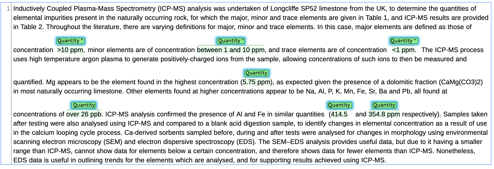

Measurement Annotation Guidelines
=================

# Table of Contents

* [Introduction](#introduction)
* [Basic Annotation Set](#basic-annotation-set)
* [Annotation Steps](#annotation-steps)
  * [Phase 1: Quantities](#phase-1-quantities)
  * [Phase 2: Quantity Modifiers, Units, and Additional Spans and Relations](#phase-2-quantity-modifiers-units-and-additional-spans-and-relations)
    * [Quantity Modifiers and Units](#quantity-modifiers-and-units)
    * [Additional Spans and Relations](#additional-spans-and-relations)
* [Special Circumstances](#special-circumstances)
  * [Percentages, Concentrations, Dilutions, and other Ratios](#percentages-concentrations-dilutions-and-other-ratios)
  * [Other special circumstances](#other-special-circumstances)
* [Additional examples](#additional-examples)
  * [Example 1](#example-1)
  * [Example 2](#example-2)
  * [Example 3](#example-3)
  * [Example 4](#example-4)

# Introduction

Counts and measurements are an important part of scientific discourse.
It is relatively easy to find measurements in text, but a bare
measurement like 17 mg is not very informative. We want to know what
thing is being measured, which property of it (e.g. length v. height),
and any relations it may have to other measurements. However, relatively
little attention has been given to parsing and extracting these
important semantic relations. Obtaining that information is challenging
because scientists' writing can be ambiguous and inconsistent, and the
location of this information relative to the measurement can vary
greatly.

MeasEval is a new entity and semantic relation extraction task focused
on finding counts and measurements, attributes of these quantities (such
as tolerances), and additional information including measured entities,
properties, and measurement contexts. MeasEval is part of the 2021
SemEval competition. More information on the MeasEval competition can be
found on our [CodaLab
page](https://competitions.codalab.org/competitions/25770) and [Github
repo](https://github.com/harperco/MeasEval).

We are collecting annotations in preparation for this competition. These
guidelines document our basic annotation set and provide rules,
guidance, and examples for a number of the challenging or ambiguous
scenarios you may encounter. The "Basic Annotation Set" and "Annotation
Steps" sections of this document discusses the general annotation model
and guidance for a two-phase annotation process. These are followed by
sections detailing Special circumstances and providing examples.

# Basic Annotation Set

The basic annotation set defined here consists of 4 types of spans, with
3 types of relationship between them.

<table>
<thead>
<tr class="header">
<th>
Span Type
</th>
<th>
Definition
</th>
</tr>
</thead>
<tbody>
<tr class="odd">
<td>
Quantity
</td>
<td>
The starting point for annotations, a Quantity is either a Count, consisting of a value, or a Measurement, consisting of a value and usually a unit. A Quantity can additionally include optional Modifiers like tolerances. A Quantity can have a relationship from either a MeasuredProperty or MeasuredEntity span via a HasQuantity relationship. If no MeasuredEntity can be identified, the Quantity must be standalone, with no relationships. See MeasuredEntity below for more information. 
 
The soda can's volume was *<strong>355 ml*</strong>.
</td>
</tr>
<tr class="even">
<td> 
</td>
<td> 
</td>
</tr>
<tr class="odd">
<td>
MeasuredEntity
</td>
<td>
A required (if possible) span that has a given Quantity either as its direct value or indirectly via a MeasuredProperty. Every Quantity should ideally be associated with a MeasuredEntity. If no relevant information appears in the text, the Quantity can be standalone, but can have no other relationships. A MeasuredEntity can be related to either a MeasuredProperty by a HasProperty relationship, or to a Quantity by a HasQuantity relationship. 
 
The *<strong>soda can</strong>*'s volume was 355 ml.
</td>
</tr>
<tr class="even">
<td>
MeasuredProperty
</td>
<td>
An optional span associated with both a MeasuredEntity and a Quantity. Not every Quantity will be associated with a MeasuredProperty. A MeasuredProperty must be related from a MeasuredEntity by a HasProperty relationship, and must be related to a Quantity through the HasQuantity relationship. 
 
The soda can's *<strong>volume</strong>* was 355 ml.
</td>
</tr>
<tr class="odd">
<td>
Qualifier
</td>
<td>
An optional Qualifier span describing special circumstances which affect a particular measurement. Qualifiers can be related to any MeasuredEntity, MeasuredProperty, or Quantity by a Qualifies relationship. 
 
The can contained 175 ml of soda *<strong>after I drank half the can</strong>*.
</td>
</tr>
<tr class="even">
<td>Unit</td>
<td>
A required (if possible) span, usually contained within the Quantity span, denoting the Unit of measurement used in the Quantity.

 

The soda can's volume was 355 <strong>*ml</strong>*.
</td>
</tr>
</tbody>
</table>

**Table 1: Basic Annotation Set**

These spans are related using three types of Relationships:

  - HasQuantity, which relates a MeasuredEntity or MeasuredProperty to a
    Qauntity;
  - HasProperty, which relates a MeasuredEntity to a MeasuredProperty;
    and
  - Qualifies, which relates a Qualifier to any MeasuredEntity,
    MeasuredProperty, or Quantity.

# Annotation Steps

The annotation process proceeds in 2 phases. Phase 1 is the simpler of
the two, and involves marking all of the Quantities in a paragraph and
recording additional information about each as described below. (The
additional pieces of information are referred to as Quantity Modifiers).
Phase 2 goes through the same paragraphs, but with only 1 Quantity
pre-selected. The annotator then marks up the MeasuredEntity,
MeasuredProperty, and Qualifier spans relevant to that Quantity as well
as all applicable relationships.

## Phase 1: Quantities

This annotation exercise is broken down by paragraph. You will see one
paragraph of text which should contain one or more Quantities. Those
Quantities may have both a value and a unit (measurements), or only a
value (counts). The values may be given with Arabic numerals (e.g. 12)
or with words (e.g. twelve, one dozen). Some words may be phrases that
do not contain numbers but are still quantities (e.g. room temperature,
sea level, standard temperature and pressure, etc.).

The first step is to read the paragraph to understand any quantities
within it. You should then annotate all Quantities in the paragraph. Be
aware that not all quantities are measurement values. Counts of
entities, such as "**five** samples", or "**15** mice", should also be
annotated as Quantities.

Be careful to include relevant text that indicates the application of a
modifier, such as "between" "less than" "approximately", or symbols such
as "\>" or "~" ***if they are contiguous with the span***. Ignore them
if they are separated by additional text, as we will return to them in
Phase 2.

Your finished document at the end of phase 1 should look like the
following
example:

## Phase 2: Quantity Modifiers, Units, and Additional Spans and Relations

This phase will contain a series of paragraphs, oftentimes duplicated,
each with one Quantity (from phase 1) annotated. You may or may not be
seeing paragraphs that you annotated previously. 

Read the paragraph and understand it well enough to do the labeling of
the MeasuredEntities, MeasuredProperties, and Qualifiers according to
the more detailed instructions and examples provided below. A Quantity's
MeasuredEntity and any relevant MeasuredProperty or Qualifiers are
collectively referred to as the context for the Quantity.

First, correct the Quantity if you notice any errors, then proceed with
**Quantity Modifiers and Units** and **Additional Spans and Relations**
according to the instructions below.

### Quantity Modifiers and Units

For each Quantity that you have annotated, follow the following steps,
according to the instructions below:

  - Add any relevant Modifiers to the Quantity annotation.
  - Add a "Unit" span for the relevant unit, if there is one.

If the Quantity is an approximate or uncertain value, include the text
that indicates this in the span and tick the "IsApproximate" box. If the
Quantity is a count, and does not have a corresponding unit, tick the
"IsCount" Box. "IsApproximate" and "IsCount" are "Quantity Modifiers",
which represent special conditions of a Quantity. 

If the Quantity represents one of the following special conditions, mark
the text that indicates this and add the appropriate "QuantityModifier"
from the dropdown. If text that indicates a modifier is adjacent to the
Quantity, the span should include the modifier text. If the modifier
text is not adjacent to the Quantity, but is adjacent to the
MeasuredEntity or MeasuredProperty, include it there, otherwise, mark it
as a Qualifier.  

Table 2 provides examples for IsApproximate, IsCount, and the eight
modifiers provided through the Dropdown. Example notation shows a
relevant sentence, followed by relevant Quantity (Quant), MeasuredEntity
(ME), MeasuredProperty (MP), and Qualifier (Qual) values. Note, these
examples do not necessarily capture all Quantities present in the
sentence, but are instead here to illustrate each of the modifiers in
use.

<table>
<thead>
<tr class="header">
<th>
Modifier
</th>
<th>
Example
</th>
<th>
Notes
</th>
</tr>
</thead>
<tbody>
<tr class="odd">
<td>
IsApproximate
</td>
<td>
The polar forcing via ion drag generates strong westward (sub-corotating) winds at a peak velocity of <strong>around 1300 m s−1</strong> near 82° latitude. 
 
<strong>Quant:</strong> around 1300 m s−1 
<strong>MP:</strong> peak velocity 
<strong>ME:</strong> strong westward (sub-corotating) winds 
<strong>Qual:</strong> near 82° latitude
</td>
<td>
&quot;Around&quot; is included as part of the quantity, as it is the term that indicates the approximate nature of the value. 
 
If this flag is not adjacent to the Quantity, it can also be included in the MeasuredProperty, or as a separate Qualifier qualifying the Quantity. See Appendix for further examples. 
 
Note that the ME is not just &quot;winds&quot;, as we try to include adjectives and important identifying information in spans.
</td>
</tr>
<tr class="even">
<td>
IsCount
</td>
<td>
This detection was based on <strong>four</strong> transits observed with the Space Telescope Imaging Spectrograph (STIS) onboard the Hubble Space Telescope (HST) (Brown et al., 2001). 
 
<strong>Quant:</strong> four 
<strong>ME:</strong> transits
</td>
<td>
Counts should not have MeasuredProperties, only MeasuredEntities. Counts must not be associated with Unit information. 
 

 

</td>
</tr>
<tr class="odd">
<td>
IsRange
</td>
<td>
Concentrations of salts in Mars soil assuming deposition during the Amazonian, a soil density of 1 g cm−3, and mixing in a <strong>range of 1.5–2.6 m</strong> depth. 
 
<strong>Quant:</strong> range of 1.5–2.6 m 
<strong>MP:</strong> depth 
<strong>ME:</strong> Mars soil
</td>
<td>
1.5-2.6 m is a simple range. Not shown here are open ended ranges where the text says something like &quot;greater than&quot; or &quot;less than&quot;. Treat those ranges without an upper or lower bound. Include that text in the span of the quantity and modifier.
</td>
</tr>
<tr class="even">
<td>
IsList
</td>
<td>
Effect of bed inventory on increase of solid minor element concentrations for bed inventories of <strong>4.5 kg, 6 kg and 13 kg</strong> CaCO3. 
 
<strong>Quant:</strong> 4.5 kg, 6 kg and 13 kg 
<strong>MP:</strong> CaCO3 
<strong>ME:</strong> bed inventories
</td>
<td>
Lists of quantities should usually be annotated as one annotation with the &quot;isList&quot; attribute. The exception to this is when lists clearly differentiate between separate MeasuredEntities, MeasureProperties, or Qualifiers, such as &quot;The apple had a diameter, circumference, and weight of 2.5 inches, 6 inches, and 9 oz respectively.&quot;

For lists that repeat the Unit, only add one Unit span once using the last instance included in the span.
</td>
</tr>
<tr class="odd">
<td>
IsMean
</td>
<td>
Despite direct solar EUV heating of Saturn’s upper atmosphere representing a minor energy source only, it is however important to note that solar EUV and shorter wavelength radiation is responsible for the majority of ionisation, and thus conductivity, outside of the narrow band of high latitude electron precipitation. In our solstice simulation (R19) we find exospheric temperatures averaged from 74°S to 90°S (the summer polar region) of <strong>490 K</strong>. 
<strong>Quant:</strong> 490 K 
<strong>MP:</strong> exospheric temperatures 
<strong>ME:</strong> solstice simulation (R19) 
<strong>Qual:</strong> averaged, from 74°S to 90°S (the summer polar region)
</td>
<td>
Note that in this example, there is another Quantity, this time a range, contained within the Qualifier. This will be managed as a separate Quantity annotation, with it's own MeasuredEntity, Unit, etc.
</td>
</tr>
<tr class="even">
<td>
IsMedian
</td>
<td>
If we use a median Os abundance in seawater of <strong>10 ppq</strong> we can evaluate the approximate Os contribution from the Caribbean LIP to the global ocean using a progressive mixing model. 
<strong>Quant:</strong> 10 ppq 
<strong>MP:</strong> Os abundance 
<strong>ME:</strong> seawater 
<strong>Qual:</strong> median
</td>
<td>
Note the mention of median, which has been underlined for clarity.
</td>
</tr>
<tr class="odd">
<td>
IsMeanHasSD
</td>
<td>
Samples were measured relative to the NIST RM 8546 standard. The external diatomite standard (1.26±0.2‰, Reynolds et al., 2007) yielded a mean and 2SD of <strong>1.23±0.25‰</strong> (n=104). 
 
<strong>Quant:</strong> 1.23±0.25‰ 
<strong>ME:</strong> Samples 
<strong>Qual:</strong> mean and 2SD, external diatomite standard 

</td>
<td>
Note the mention of mean and SD, which has been underlined.
</td>
</tr>
<tr class="even">
<td>
IsMeanHasTolerance
</td>
<td>
Woods et al. (2000) studied the variability of solar Lyman α emissions based on satellite observations spanning four and a half solar cycles between 1947 and 1999. They found that the average variability during one solar rotation was found to be <strong>9 ± 6%</strong>. 
 
<strong>Quant:</strong> 9 ± 6% 
<strong>MP:</strong> average variability 
<strong>ME:</strong> solar Lyman α emissions 
<strong>Qual:</strong> during one solar rotation
</td>
<td>
Note the mention of average, which has been underlined, and which in this case is not adjacent to the Quantity and is marked as part of the MeasuredProperty.

Also note that here, the ± represents a tolerance rather than an Standard Deviation, as there is no Mean.
</td>
</tr>
<tr class="odd">
<td>
IsRangeHasTolerance
</td>
<td>
Even higher temperatures in Saturn’s auroral oval of <strong>(563–624) ± 30 K</strong> were derived from Cassini VIMS observations by Stallard et al. 
 
<strong>Quant:</strong> (563–624) ± 30 K 
<strong>MP:</strong> temperatures 
<strong>ME:</strong> Saturn’s auroral oval
</td>
<td>
 

</td>
</tr>
<tr class="even">
<td>
HasTolerance
</td>
<td>
Recent sanidine 40Ar/39Ar and zircon 206Pb/238U geochronology integrated with astrochronology constrain the CTB at <strong>93.90±0.15 Ma</strong>. 
 
<strong>Quant:</strong> 93.90±0.15 Ma. 
<strong>ME:</strong> CTB
</td>
<td>
 

</td>
</tr>
</tbody>
</table>

**Table 2: Quantity Annotation Modifiers**

Finally, if your Quantity is not marked IsCount, mark the span for the
relevant Unit of measurement if there is one. Units will usually be a
sub-span contained within the already marked Quantity.

### Additional Spans and Relations

Each Quantity should be related to a MeasuredEntity, such as the
particles being added to an epoxy, and optionally to a MeasuredProperty,
such as particle diameter and/or rate of mixing the particles into the
epoxy. If you can not find a MeasuredEntity, the Quantity can be left
standalone, but you should not mark a MeasuredProperty or Qualifier
without a MeasuredEntity.

For each Quantity that you have annotated, follow the following steps:

  - Mark the span for the MeasuredEntity of the Quantity.
  - If none is present, move on to the next Quantity.
  - Mark the MeasuredProperty, if present.
  - Mark any Qualifier spans that are necessary to interpret and
    understand the Quantity.
  - For all components of the Quantity's Context, err on the side of
    including any modifying adjectives or nouns, such as "Venera-I
    spacecraft" rather than "spacecraft".

Finally, go through and create relationships between the various spans
you've marked.

For each Quantity in the paragraph:

  - Create a "HasQuantity" relationship from the MeasuredProperty, if
    there is one, to the Quantity. If there is no MeasuredProperty,
    created a "HasQuantity" relationship directly from the
    MeasuredEntity to the Quantity.
  - Create a "HasProperty" relationship from the MeasuredEntity to the
    MeasuredProperty where there is a MeasuredProperty, connecting to
    the Quantity.

If the language indicating the Modifier is adjacent to an existing
Quantity, MeasuredEntity, or MeasuredProperty, include it in the marked
span. If it is elsewhere mark it separately as a Qualifier and associate
it with the Quantity with a Qualifies relationship.

For example, given the sentence "The mean diameter of the S-CSR
particles was 0.18 μm.", create the following annotations:

<table>
<thead>
<tr class="header">
<th>
Quantity
</th>
<th>
Modifiers
</th>
<th>
MeasuredEntity
</th>
<th>
MeasuredProperty
</th>
<th>
Qualifiers
</th>
<th>Relationsihps</th>
</tr>
</thead>
<tbody>
<tr class="odd">
<td>
0.18 μm
</td>
<td>
IsMean
</td>
<td>
S-CSR particles
</td>
<td>
mean diameter
</td>
<td>
 

</td>
<td>HasQuantity from &quot;mean diameter&quot; to &quot;0.18 μm&quot;. 
HasProperty from &quot;S-CSR particles&quot; to &quot;mean diameter&quot;.</td>
</tr>
</tbody>
</table>

If there is no explicit MeasuredProperty, a quantity can be applied
directly to a MeasuredEntity. For example, given the sentence, "However,
some elements are only present for the largest bed inventory of 13 kg
e.g., Ti, Cr, and Mn.", the Quantity is "13 kg" and the MeasuredEntity
is "bed inventory".

If there are additional conditions or context that are essential for
understanding any aspects of these measurements, those additional spans
can be marked with an optional "Qualifier" span. These "Qualifiers" are
then marked as having a "Qualifies" relationship to any other Quantity,
MeasuredEntity, or MeasuredProperty span.

Apply annotations liberally, but use Qualifiers sparingly. Sometimes the
terminology will seem like a stretch for a given use. If you're unsure
about how something relates to the actual measurement, consider omitting
it. If you are certain of its importance, consider marking it as a
Qualifier.

# Special Circumstances

**Note, for these special instructions, and the additional examples at
the end of this document, we do not include Relationships and Units as
we think they are self-explanatory.**

## Percentages, Concentrations, Dilutions, and other Ratios

Percentages and concentrations don't always read like
MeasuredProperty/Quantity pairs, but can often be interpreted as such.
We have a set of rules to define how to manage such circumstances:

  - **Basic percentages:** if a quantity is a percentage, try to find
    its numerator and denominator. Mark the numerator as the
    MeasuredProperty and the denominator as the MeasuredEntity. This
    also applies for concentrations where the solvent is given. For
    example, given:  
    "DA1 also contains on average 5% peridinoid cysts including
    Deflandrea spp. regarded as a coastal/neritic taxon indicating high
    productivity and nutrient availability (Brinkhuis, 1994; Pross and
    Brinkhuis, 2005)."

    <table>
    <thead>
    <tr class="header">
    <th>
Quantity
</th>
    <th>
Modifiers
</th>
    <th>
MeasuredEntity
</th>
    <th>
MeasuredProperty
</th>
    <th>
Qualifiers
</th>
    </tr>
    </thead>
    <tbody>
    <tr class="odd">
    <td>
average 5%
</td>
    <td>
IsMean
</td>
    <td>
DA1
</td>
    <td>
peridinoid cysts
</td>
    <td>
 
    
</td>
    </tr>
    </tbody>
    </table>

  - Note that these can be more complex, sometimes including Qualifiers
    to provide further information about either the numerator or the
    denominator:  
    "Oi1 typifies the non-linearity of global climate, with the
    emplacement of an ice volume between 60% and 100% of that present
    today on Antarctica over only ∼400 ka, superimposed on a
    million-year timescale cooling
    trend"

    | Quantity             | Modifiers | MeasuredEntity | MeasuredProperty | Qualifiers                                                                                                                              |
    | -------------------- | --------- | -------------- | ---------------- | --------------------------------------------------------------------------------------------------------------------------------------- |
    | between 60% and 100% | IsRange   | ice volume     | emplacement      | present today on Antarctica (Qualifying ice volume), over only ~400 ka (Qualifying emplacement), and Oi1 (also Qualifying emplacement). |

  - **Denominatorless concentrations**: If the solution is not
    specifically mentioned, the component may be marked as the
    MeasuredEntity, and the notion of the concentration is the
    MeasuredProperty. For example, given the text:  
    "Fig. 7 shows solid concentrations of trace elements, of which only
    Rb, Nb and W were found at concentrations greater than 0.1 ppm."

    <table>
    <thead>
    <tr class="header">
    <th>
Quantity
</th>
    <th>
Modifiers
</th>
    <th>
MeasuredEntity
</th>
    <th>
MeasuredProperty
</th>
    <th>
Qualifiers
</th>
    </tr>
    </thead>
    <tbody>
    <tr class="odd">
    <td>
greater than 0.1 ppm
</td>
    <td>
IsRange
</td>
    <td>
Rb, Nb and W
</td>
    <td>
concentrations
</td>
    <td>
 
    
</td>
    </tr>
    </tbody>
    </table>

    Note that some denominatorless concentrations may not use the word
    concentration, in which case you should mark the component as the
    MeasuredEntity and directly relate it to the Quantity with a
    HasQuantity relationship.

<!-- end list -->

  - **Explicit Ratios** If the Quantity is a ratio X:Y, mark the term
    ratio as the MeasuredProperty and the entire X:Y string as the
    MeasuredEntity. For example:  
    "The concentrations are far below what would be inferred from
    observations of perchlorate:nitrate ratios ∼1:60 measured in
    EETA79001 (Kounaves et al., 2014)"

    <table>
    <thead>
    <tr class="header">
    <th>
Quantity
</th>
    <th>
Modifiers
</th>
    <th>
MeasuredEntity
</th>
    <th>
MeasuredProperty
</th>
    <th>
Qualifiers
</th>
    </tr>
    </thead>
    <tbody>
    <tr class="odd">
    <td>
~1:60
</td>
    <td>
IsApproximate
</td>
    <td>
perchlorate:nitrate
</td>
    <td>
ratios
</td>
    <td>
 
    
</td>
    </tr>
    </tbody>
    </table>

    Note that not all ratios will explicitly include the term ratio, in
    which case you should mark the X:Y string as the MeasuredEntity and
    direclty relate it to the Quantity with a HasQuantity relationship.

## Other special circumstances

  - **Processes and Events**: Events and processes are often captured as
    a MeasuredProperty of the MeasuredEntity that they "happen to". For
    example:  
    "Oi1 typifies the non-linearity of global climate, with the
    emplacement of an ice volume between 60% and 100% of that present
    today on Antarctica over only ∼400 ka, superimposed on a
    million-year timescale cooling trend." (Readers will have noticed
    this sentence was used in an earlier example, but that the values in
    the tables are different. This is because the two Quantities being
    described are different.)

    <table>
    <thead>
    <tr class="header">
    <th>
Quantity
</th>
    <th>
Modifiers
</th>
    <th>
MeasuredEntity
</th>
    <th>
MeasuredProperty
</th>
    <th>
Qualifiers
</th>
    </tr>
    </thead>
    <tbody>
    <tr class="odd">
    <td>
~400 ka
</td>
    <td>
IsApproximate
</td>
    <td>
Oi1
</td>
    <td>
emplacement of an ice volume
</td>
    <td>
 
    
</td>
    </tr>
    </tbody>
    </table>

  - Exceptions to the above occur when the action is part of another
    explicit MeasuredProperty of a MeasuredEntity. In these cases, the
    action is a Qualifier. For example, in the following text, we will
    have two Qualifiers, "mixed", Qualifying "depth", and "average",
    Qualifying "2 m".  
    "If we assume the soil is mixed to an average depth of 2 m and the
    parent salt is Ca(ClO4)2 or Mg(ClO4)2, then we calculate
    concentrations of 4.3 × 10−8 wt. % and 4.0 × 10−10 wt. %,
    respectively."

    | Quantity | Modifiers | MeasuredEntity | MeasuredProperty | Qualifiers     |
    | -------- | --------- | -------------- | ---------------- | -------------- |
    | 2 m      | IsMean    | soil           | depth            | mixed, average |

  - **Implicit frequencies and durations** For frequencies, durations,
    and other kinds of scheduled / timed processes, if there is no
    explicit MeasuredEntity, mark the process as the MeasuredEntity and the
    schedule or frequency as the Quantity. For example:  
    "They found that the variability ranges between 1% and 37% during
    one period of solar rotation (27 days), and the average variability
    during one solar rotation was found to be 9 ± 6%."

    <table>
    <colgroup>
    <col style="width: 20%" />
    <col style="width: 20%" />
    <col style="width: 20%" />
    <col style="width: 20%" />
    <col style="width: 20%" />
    </colgroup>
    <thead>
    <tr class="header">
    <th>
Quantity
</th>
    <th>
Modifiers
</th>
    <th>
MeasuredEntity
</th>
    <th>
MeasuredProperty
</th>
    <th>
Qualifiers
</th>
    </tr>
    </thead>
    <tbody>
    <tr class="odd">
    <td>
27 days
</td>
    <td>
 
    
</td>
    <td>
period of solar rotation
</td>
    <td>
 
    
</td>
    <td>
 
    
</td>
    </tr>
    <tr class="even">
    <td>
one
</td>
    <td>
IsCount
</td>
    <td>
period of solar rotation
</td>
    <td>
 
    
</td>
    <td>
 
    
</td>
    </tr>
    </tbody>
    </table>

  - **Explicit frequencies and durations** For frequencies, durations,
    and other kinds of scheduled / timed processes, if there is an
    explicit entity, mark the process as the MeasuredProperty and the
    schedule or frequency as the Quantity. For example For example:  
    "The rotation period of HD209458 is estimated to be ∼10–11 days
    (Silva-Valio,
    2008).""

    | Quantity    | Modifiers     | MeasuredEntity | MeasuredProperty | Qualifiers |
    | ----------- | ------------- | -------------- | ---------------- | ---------- |
    | ~10-11 days | IsApproximate | HD209458       | rotation period  | estimated  |

  - **Experimental Conditions** Conditions, such as temperatures, times,
    or rates, can be related directly to MeasuredEntities if there is no
    explicit MeasuredProperty. For example, given the sentence:  
    "Cleaned sponge and diatom opal was dissolved via wet alkaline
    digestion at 100 °C for 40 min."

    <table>
    <thead>
    <tr class="header">
    <th>
Quantity
</th>
    <th>
Modifiers
</th>
    <th>
MeasuredEntity
</th>
    <th>
MeasuredProperty
</th>
    <th>
Qualifiers
</th>
    </tr>
    </thead>
    <tbody>
    <tr class="odd">
    <td>
100 °C
</td>
    <td>
 
    
</td>
    <td>
wet alkaline digestion
</td>
    <td>
 
    
</td>
    <td>
 
    
</td>
    </tr>
    <tr class="even">
    <td>
40 min
</td>
    <td>
 
    
</td>
    <td>
wet alkaline digestion
</td>
    <td>
 
    
</td>
    <td>
 
    
</td>
    </tr>
    </tbody>
    </table>

  - **Changes in Value** For changes in value, annotate the
    MeasuredEntity and MeasuredProperty as usual, mark the Quantity as a
    range, and add the notion of "change" as a Qualifier For example,
    given the sentences:  
    "Sing et al. (2008a,b) used observations of the Na D line profile to
    constrain the temperature profile in the upper atmosphere. Relying
    on the same observations, Vidal-Madjar et al. (2011a,b) predicted
    that the temperature increases steeply from 1300 K to 3500 K near
    the 1 μbar level."

    <table>
    <thead>
    <tr class="header">
    <th>
Quantity
</th>
    <th>
Modifiers
</th>
    <th>
MeasuredEntity
</th>
    <th>
MeasuredProperty
</th>
    <th>
Qualifiers
</th>
    </tr>
    </thead>
    <tbody>
    <tr class="odd">
    <td>
1300 K to 3500 K
</td>
    <td>
IsRange
</td>
    <td>
upper atmosphere
</td>
    <td>
temperature
</td>
    <td>
increases, near the 1 μbar level
</td>
    </tr>
    <tr class="even">
    <td>
1 μbar
</td>
    <td>
 
    
</td>
    <td>
upper atmosphere
</td>
    <td>
level
</td>
    <td>
 
    
</td>
    </tr>
    </tbody>
    </table>

    Changes in value should have an IsRange Modifier in the Quantity.
    Note that "increases", and "near the 1 μbar level" above indicate
    the application of two separate Qualifiers.

  - **Things named by Quantities** Sometimes you will find a Quantity
    used to refer to a specific thing based on a characteristic. In
    these cases, just mark the MeasuredEntity / Quantity pair. For
    example, given the sentence:  
    "From this pre-cleaned sample the \>100 μm fraction was separated
    using microseparation."

    <table>
    <thead>
    <tr class="header">
    <th>
Quantity
</th>
    <th>
Modifiers
</th>
    <th>
MeasuredEntity
</th>
    <th>
MeasuredProperty
</th>
    <th>
Qualifiers
</th>
    </tr>
    </thead>
    <tbody>
    <tr class="odd">
    <td>
&gt;100 μm
</td>
    <td>
IsRange
</td>
    <td>
fraction
</td>
    <td>
 
    
</td>
    <td>
 
    
</td>
    </tr>
    </tbody>
    </table>

  - \***Complex Relations**\* if a quantity has involvement from more
    than just an entity and property, remember that qualifiers can be
    used to express conditions for a measurement. See below for
    additional complex relation examples.  

# Additional examples

Below are additional examples. Read through the paragraphs and try to
identify the relevant span types, then see if you agree with the answers
given.

**Note, for the sake of simplicity, these examples do not show Units or
Relationships. Please do be sure to always include a Unit (if present)
and all necessary Relationships in your annotations.**

#### Example 1

Text: "Choosing a lower boundary pressure of 1 μbar based on the
location of the H2/H dissociation front in recent photochemical models
(Moses et al., 2011) and observational constraints (France et al.,
2010), we estimated a mean temperature of about 8250 K in the
thermosphere below 3Rp. However, the uncertainty of the observations is
large, and the 1σ upper and lower limits on this temperature are
approximately 6000 K and 11,000 K, respectively."

<table>
<thead>
<tr class="header">
<th>
Quantity
</th>
<th>
Modifiers
</th>
<th>
MeasuredEntity
</th>
<th>
MeasuredProperty
</th>
<th>
Qualifiers
</th>
</tr>
</thead>
<tbody>
<tr class="odd">
<td>
1 μbar
</td>
<td>
 

</td>
<td>
lower boundary
</td>
<td>
pressure
</td>
<td>
 

</td>
</tr>
<tr class="even">
<td>
about 8250 K
</td>
<td>
IsApproximate, IsMean
</td>
<td>
thermosphere below 3Rp
</td>
<td>
temperature
</td>
<td>
mean
</td>
</tr>
<tr class="odd">
<td>
approximately 6000K
</td>
<td>
IsApproximate
</td>
<td>
thermosphere below 3Rp
</td>
<td>
temperature
</td>
<td>
upper, limits
</td>
</tr>
<tr class="even">
<td>
11,000 K
</td>
<td>
IsApproximate
</td>
<td>
thermosphere below 3Rp
</td>
<td>
temperature
</td>
<td>
lower limits, approximately
</td>
</tr>
<tr class="odd">
<td>below 3Rp</td>
<td>IsRange</td>
<td>thermosphere</td>
<td> 
</td>
<td> 
</td>
</tr>
</tbody>
</table>

Note, this example covers cases where the approximate token is shared
between two values. In one case, it is adjacent to the value, and can be
included, but in the other it is non-contiguous and is added as a span.
Additionally, "respectively" here is a keyword indicated that these
values should be treated separately rather than combined using IsRange
or IsList. Additionally, note that we annotate the language as provided.
In this case, thought the author seems to have mistakenly flipped the
"upper" and "lower" values, we adhere to the language given.

#### Example 2

Text: "There are caveats to the results reported here. We measured
depressive symptoms using validated instruments, such as the General
Health Questionnaire and CES-D, and information on prescribed
antidepressant medication use (26,29,49). These instruments are not
designed to make a psychiatric diagnosis of first or recurrent major
depression (26,29); they defined only partially overlapping case
populations and some misclassification occurred because antidepressants
are also prescribed for conditions other than depression. Nevertheless,
the associations of manifest CHD and stroke with depressive symptoms in
our study are in agreement with previous research linking vascular
disease to depressive symptoms and clinical depression (4,35–38,44).
Furthermore, in a validation study of 274 elderly participants from our
cohort, sensitivity and specificity of the questionnaire measures with
depression diagnosed based on structured psychiatric interview as the
criterion are high, almost 90% for CES-D depressive symptoms and
approximately 80% for GHQ symptoms."

<table>
<thead>
<tr class="header">
<th>
Quantity
</th>
<th>
Modifiers
</th>
<th>
MeasuredEntity
</th>
<th>
MeasuredProperty
</th>
<th>
Qualifiers
</th>
</tr>
</thead>
<tbody>
<tr class="odd">
<td>274</td>
<td>IsCount</td>
<td>elderly participants</td>
<td> 
</td>
<td> 
</td>
</tr>
<tr class="even">
<td>almost 90%</td>
<td>IsApproximate</td>
<td>validation study</td>
<td>sensitivity and specificity</td>
<td>CES-D depressive symptoms</td>
</tr>
<tr class="odd">
<td>approximately 80%</td>
<td>IsApproximate</td>
<td>validation study</td>
<td>sensitivity and specificity</td>
<td>GHQ symptoms</td>
</tr>
</tbody>
</table>

#### Example 3

Text: "Calculated solid Ca-based species (MTDATA) for 0 ppm, 1000 ppm
and 2000 ppm SO2."

<table>
<thead>
<tr class="header">
<th>
Quantity
</th>
<th>
Modifiers
</th>
<th>
MeasuredEntity
</th>
<th>
MeasuredProperty
</th>
<th>
Qualifiers
</th>
</tr>
</thead>
<tbody>
<tr class="odd">
<td>0 ppm, 1000 ppm and 2000 ppm</td>
<td>IsList</td>
<td>SO2</td>
<td> 
</td>
<td> 
</td>
</tr>
</tbody>
</table>

#### Example 4

Text: "Magnesium nitride, Mg3N2 was prepared by reaction of the pure
metal (Alfa 99.9%) with nitrogen using liquid sodium (Riedel-Haën,
\>99%) as a solvent. All manipulations were carried out in an inert
atmosphere. In an argon-filled glovebox a piece of magnesium (ca. 15 g)
was cut from a larger ingot and the covering oxide layer physically
removed with a file. The clean magnesium metal was submerged in molten
sodium contained within a stainless steel crucible. The crucible was
then sealed inside a stainless steel reaction vessel fitted with a cold
finger. The vessel was heated for 72 h at 1023 K under 1 bar of nitrogen
pressure. Upon cooling, the vessel was placed under a vacuum of 10−4
Torr and heated for 24 h at 823 K to remove the sodium. Once cooled to
room temperature, the vessel was loaded into a glovebox and opened in a
nitrogen atmosphere. Mg3N2 was obtained as a yellow-green powdered
solid. Phase purity was confirmed using powder X-ray diffraction by
comparison to ICDD PDF database (card number 35-778; Supplementary Fig.
S1)."

<table>
<thead>
<tr class="header">
<th>
Quantity
</th>
<th>
Modifiers
</th>
<th>
MeasuredEntity
</th>
<th>
MeasuredProperty
</th>
<th>
Qualifiers
</th>
</tr>
</thead>
<tbody>
<tr class="odd">
<td>99.9%</td>
<td> 
</td>
<td>   metal</td>
<td>pure</td>
<td>Magnesium</td>
</tr>
<tr class="even">
<td>&gt;99%</td>
<td>IsRange</td>
<td>liquid sodium</td>
<td> 
</td>
<td> 
</td>
</tr>
<tr class="odd">
<td>ca. 15 g</td>
<td>IsApproximate</td>
<td>magnesium</td>
<td> 
</td>
<td> 
</td>
</tr>
<tr class="even">
<td>72 h</td>
<td> 
</td>
<td>vessel</td>
<td>heated</td>
<td> 
</td>
</tr>
<tr class="odd">
<td>1023 K</td>
<td> 
</td>
<td>vessel</td>
<td>heated</td>
<td> 
</td>
</tr>
<tr class="even">
<td>1 bar</td>
<td> 
</td>
<td>nitrogen pressure</td>
<td> 
</td>
<td> 
</td>
</tr>
<tr class="odd">
<td>24 h</td>
<td> 
</td>
<td>vessel</td>
<td>heated</td>
<td> 
</td>
</tr>
<tr class="even">
<td>823 K</td>
<td> 
</td>
<td>vessel</td>
<td>heated</td>
<td> 
</td>
</tr>
<tr class="odd">
<td>10−4 Torr</td>
<td> 
</td>
<td>vacuum</td>
<td> 
</td>
<td> 
</td>
</tr>
<tr class="even">
<td>room temperature</td>
<td> 
</td>
<td>vessel</td>
<td>cooled</td>
<td> 
</td>
</tr>
</tbody>
</table>
